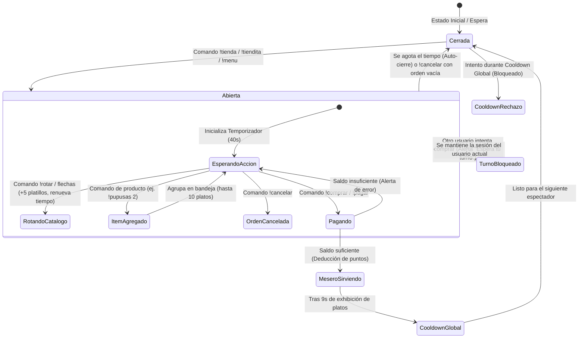
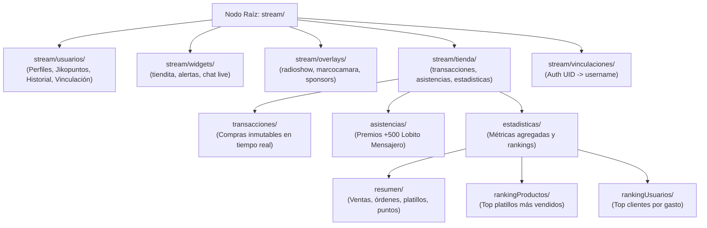
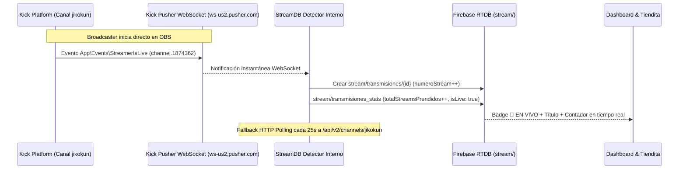

# 🏪 DOCUMENTACIÓN TÉCNICA Y LÓGICA DEL SISTEMA: TIENDITA DE JIKO & JIKOPUNTOS

> **Archivo del Widget:** [tiendita.html](file:///e:/Proyectos%20Web/multi-ideas-sv/mini_widgets/tiendita.html)  
> **Panel de Pruebas & Control:** [prueba.html](file:///e:/Proyectos%20Web/multi-ideas-sv/prueba.html)  
> **Última Actualización:** Octubre 2026  
> **Versión:** 2.0 (Sistema de Turnos, Platos en Mesa, Asistencia Lobito & Carrusel Vertical)

---

## 📌 1. RESUMEN EJECUTIVO Y PROPÓSITO
La **Tiendita de Jiko** es un widget interactivo para streaming (OBS Studio / Kick / Streamer.bot) que recrea un puesto de comida rápida tradicional y sci-fi con temática verde neón de Kick y madera rústica. Permite a los espectadores canjear productos con su saldo de **Jikopuntos**, gestionar turnos en vivo, armar pedidos múltiples (hasta 10 platos), ver a un mesero animado servir la comida sobre la mesa, y registrar la asistencia de la transmisión con premios automáticos.

---

## 🎨 2. IDENTIDAD VISUAL Y ESTILOS (DESIGN SYSTEM)

### Variables CSS y Colores
- `--kick: #53fc18`: Verde neón característico de Kick.
- `--kick-soft: #b4ff8a`: Verde suave para resaltados e iluminación secundaria.
- `--kick-dim: rgba(83,252,24,.16)`: Resplandor sutil de fondo.
- `--oro: #ffd35c`: Dorado brillante para precios, monedas y rangos VIP.
- `--rojo: #ff5c6c`: Rojo advertencia para cancelaciones o errores.
- `--tinta: #eaffea`: Tipografía clara de alto contraste.
- `--apagado: #8fa88f`: Textos secundarios y metadatos.
- `--madera-1..3: #7a5230, #5a3a1e, #3c2611`: Gradientes oscuros estilo mostrador rústico.
- **Tipografías:**
  - Display: `'Unbounded'` (Google Fonts) para títulos de neón y badges.
  - Cuerpo: `'Chakra Petch'` (Google Fonts) para comandos, botones y saldo.

### Componentes de Interfaz
1. **Toldo a rayas (`.awning` & `.scallops`)**: Toldo superior rayado en verde neón y verde oscuro con festones curvos.
2. **Cuerpo del mostrador (`.shop-body`)**: Madera sci-fi con borde de 3px y resplandor neón exterior.
3. **Letrero Colgante ABIERTO (`.open-sign`)**: Animación de balanceo continuo mediante péndulo CSS.
4. **Alerta de Turno (`#turn-alert`)**: "Espera tu turno @usuario", aparece arriba del mostrador con sacudida si otro usuario intenta operar.
5. **Barra de Cuenta Regresiva (`#cd-bar`)**: Indicador de tiempo restante de la sesión activa del usuario.

---

## 💰 3. ECONOMÍA Y CATÁLOGO DE PRODUCTOS (44 ÍTEMS)

### Regla Económica de Precios
- **Piso Mínimo:** Ningún producto cuesta menos de **120 Jikopuntos** (para balancear espectadores con más de 5,000 a 10,000 puntos).
- **Rango de Precios:**
  - **120 – 140 pts:** Bebidas básicas y acompañamientos (Vaso de Agua: 120, Galleta: 130).
  - **145 – 165 pts:** Cafés, sodas, tés, jugos y postres (Café: 145, Horchata: 150, Coca-Cola: 150, Matcha: 155, Papitas: 160).
  - **170 – 185 pts:** Comida típica callejera (Pastelitos: 170, Tamal: 180, Yuca Frita: 180, Arepita: 180, Tequeyoyo: 185).
  - **190 – 230 pts:** Bebidas alcohólicas y platillos fuertes (Hot Dog: 190, Cerveza: 190, Pupusas: 200, Guarito: 210, Salchipapa: 210, Burrito: 220, Vinito: 230).
  - **240 – 280 pts:** Hamburguesa (250), Sopita (240), Pollo Frito (280).
  - **320 pts:** Platillo insignia premium (Pabellón Criollo).

### Soporte de Aliases en Comandos
Cada ítem cuenta con sinónimos normalizados para que el chat pueda ordenarlo de forma natural (ejemplo: `!arepa`, `!arepas`, `!tequeño`, `!empanada`, `!matchalatte`, `!cerveza`).

---

## 🛒 4. FLUJO DE ATENCIÓN Y SISTEMA DE TURNOS



### Reglas de Turno
1. **Regla de Exclusividad:** Solo **1 usuario a la vez** puede tener el mostrador abierto. Si otro usuario envía comandos, se dispara la alerta `#turn-alert` indicando quién tiene la tienda ocupada.
2. **Regla de Tienda Cerrada:** Si la tienda está cerrada, no se pueden comprar productos directamente; el usuario debe escribir obligatoriamente `!tienda` o `!tiendita` primero para acercarse al mostrador.
3. **Renovación de Tiempo:** Cada vez que el usuario activo agrega un plato o usa `!rotar`, su tiempo en la tienda se renueva automáticamente.
4. **Cooldown Global (`COOLDOWN_GLOBAL_MS`):** Tras cerrarse o entregarse una orden, se activa un tiempo de recarga para evitar saturación de pantalla.

---

## 🍽️ 5. ARQUITECTURA DE LA BANDEJA Y ESCENA DEL MESERO

### Bandeja de Pedidos (`#order-tray` & `#confirm-box`)
- Permite almacenar hasta **20 platos** en la misma mesa (`MAX_ORDEN_ITEMS = 20`).
- Agrupa productos idénticos en fichas con contador (`x2`, `x3`, ..., `x20`), precio acumulado y botón de eliminar (`✕`).
- Admite cantidades por comando de chat: `!pupusas 3`, `!tamal x5`, `!comprar cafe 2`.
- El total se actualiza en vivo y valida si el saldo del usuario alcanza antes de permitir el cobro.

### Escena de Entrega del Mesero (`mostrarMeseroEntrega`)
- Se activa al pagar exitosamente (`!comprar` o botón "Pagar Todo").
- Suena la campana de servicio (`playSfx('serve')`).
- La tienda se oculta y entra la escena limpia del mesero (`mesero.png`) con la mesa servida.
- **Escalado Proporcional y Adaptativo (1 a 20 Platillos):**
  - **1 solo ítem (`.modo-solo`):** Ocupa una posición central imponente y apetitosa (hasta 245px de alto y 370px de ancho con sombra 3D profunda), evitando que quede pequeño o perdido en la mesa.
  - **2 ítems (`.modo-duo`):** Distribución amplia en primer plano (hasta 210px de alto y 295px de ancho).
  - **3 ítems (`.modo-trio`):** Trío armónico que llena la superficie de la mesa (hasta 190px de alto y 250px de ancho).
  - **4 ítems (`.modo-cuarteto`):** Cuarteto equilibrado en fila delantera (hasta 170px de alto y 205px de ancho).
  - **5 a 20 ítems (`.modo-banquete`):** Se distribuyen equitativamente en **2 filas** (fila trasera con perspectiva lejana escalada y fila delantera en primer plano), reduciendo el tamaño de forma gradual desde 175px hasta 82px según la densidad de platos para encajar perfectamente sin desbordar la mesa de madera.
- Tras **9 segundos**, el mesero se retira suavemente (`.saliendo`) y activa el cooldown global.

---

## 🐺 6. SISTEMA DE BIENVENIDA (+500 PTS) Y LISTA DE ASISTENCIA (`!pasarlista`)

### Bienvenida Automática de Lobito Mensajero
- **Detección en tiempo real:** Intercepta en el chat el mensaje generado por el bot:
  ```text
  Gracias por estar aquí $(name)!
  ```
- **Filtro inteligente:** Se ejecuta **antes** del filtro de bots para no descartar el mensaje del bot y extraer correctamente al espectador recibido.
- **Bonificación:** Otorga automáticamente **+500 Jikopuntos** al espectador recién llegado.
- **Prevención de duplicados:** Cada usuario solo recibe la bonificación de asistencia **1 vez por transmisión**.
- **Persistencia:** Almacena los registros en `localStorage` con la clave `tiendita_asistencia_stream_v1` durante **18 horas** (para sobrevivir a recargas de fuente en OBS).
- **Sincronización con Streamer.bot:** Envía una acción `DoAction` con nombre `Tiendita_AsistenciaRegistrada`.

### Tarjeta de Asistencia (`!pasarlista`)
- **Comando:** `!pasarlista` (Único y exclusivo para `@Jikokun` o `broadcaster`; `!lista` se mantiene independiente para OBS/música).
- **Duración:** Permanece visible en pantalla durante exactamente **1 minuto (60 segundos)** con barra de progreso regresiva (`#pl-timer-bar`).
- **Límite Visual:** Diseñado para mostrar un **máximo de 3 usuarios visibles a la vez** (`height: 156px`). La alerta completa mide solo ~285px de altura total y ocupa menos del **6% del área de pantalla en 1080p** (cumpliendo con la regla de no ocupar más de un cuarto de pantalla).
- **Carrusel Vertical Infinito:** Si hay **más de 3 asistentes**, se activa automáticamente el carrusel vertical continuo (`.is-carousel` y `.pl-carousel-group.animating`), rotando a todos los espectadores de forma suave con máscara de difuminado superior e inferior y pausa al pasar el cursor.
- **Comandos de Administración:**
  - `!cerrarlista` / `!ocultarlista`: Cierra la tarjeta inmediatamente.
  - `!limpiarasistencia` / `!resetasistencia`: Reinicia el registro de asistentes de la sesión.
- **Detección de Transmisión:** Al recibir los eventos `StreamStarted` o `StreamOnline` desde Streamer.bot, la asistencia se reinicia automáticamente para el nuevo directo.

---

## ⭐ 7. CONSULTA DE SALDO FLOTANTE (`!jikopuntos`)
- **Comandos:** `!jikopuntos`, `!puntos`, `!saldo`, `!points`, `!misjikopuntos`.
- **Comportamiento:** Muestra una tarjeta compacta con avatar del usuario, saludo y su saldo actual durante 5.5 segundos.
- **Anti-solapamiento:** Si la tienda está abierta en la parte inferior, la tarjeta de jikopuntos sube automáticamente (`.card-jikopuntos.arriba`) para no tapar los productos.

---

## 🔊 8. EFECTOS DE SONIDO WEB AUDIO (SFX)
Generados mediante osciladores matemáticos nativos (sin archivos externos pesados):
- `'open'`: Tono ascendente senoidal para aperturas de tarjetas.
- `'select'`: Chime agudo senoidal para añadir ítems o rotar vitrina.
- `'buy'`: Arpegio en triángulo (F#5 a A5) para cobro de compras.
- `'serve'`: Campana doble de restaurante (C6, E6, C7) con caída suave al servir platos.
- `'error'`: Tono grave en diente de sierra (180Hz a 120Hz) para turnos ocupados o saldo insuficiente.

---

## 🔌 9. PROTOCOLO WEBSOCKET & STREAMER.BOT

### Conexión
- URL por defecto: `ws://127.0.0.1:4445/` (configurable con parámetro `?port=XXXX`).
- Suscripción automática a eventos de Kick y Twitch (`ChatMessage`).

### Acciones Enviadas a Streamer.bot (`DoAction`)
1. `Tiendita_ConfirmarCompra`: Envía comprador, lista de platos, claves, costo total y nuevo saldo.
2. `Tiendita_AsistenciaRegistrada`: Envía usuario saludado por Lobito, puntos ganados (+500), nuevo saldo y total de asistentes.
3. `Tiendita_RegalarPuntos`: Envía administrador, receptor, cantidad otorgada y nuevo saldo.

### Acciones Recibidas desde Streamer.bot
- `PasarLista` / `!pasarlista`: Despliega la tarjeta de asistencia de 60s.
- `IniciarTransmision`: Reinicia el registro de asistencia.
- Eventos de actualización de puntos en vivo.

---

## 🪟 10. PARÁMETROS URL PARA OBS STUDIO

| Parámetro | Valor por defecto | Descripción |
| :--- | :--- | :--- |
| `?overlay=true` | `false` | **Modo OBS Limpio:** Oculta barra flotante de pruebas y botones inferiores. |
| `?duration=XX` | `40` | Segundos antes de que el mostrador se cierre automáticamente si el usuario no interactúa. |
| `?port=XXXX` | `4445` | Puerto del WebSocket de Streamer.bot. |
| `?mute=true` | `false` | Silencia todos los efectos de sonido Web Audio. |
| `?preview=true` | `false` | Modo de previsualización en pestañas externas. |

---

## 🧪 11. COMANDOS EXTERNOS VÍA POSTMESSAGE (`prueba.html`)
El panel de pruebas [prueba.html](file:///e:/Proyectos%20Web/multi-ideas-sv/prueba.html) se comunica con el widget incrustado mediante `postMessage`:
- `BUY_ITEM`: Fuerza el pago de la orden actual.
- `CANCEL_ITEM`: Cancela o vacía la orden activa.
- `SELECT_ITEM`: Añade un ítem específico por clave (ej. `pupusas`, `pabellon`, `vasoagua`).
- `FEAST_10`: Simula una orden masiva de 10 platillos (prueba de 2 filas).
- `TRIPLE_ORDER`: Simula una orden triple de comida rápida.
- `TEST_OTHER_USER`: Simula intento de otro espectador para comprobar la alerta de turno.
- `RESET_COOLDOWN`: Restablece el cooldown a 0 segundos.
- `GIFT_POINTS`: Otorga +500 Jikopuntos de prueba.
- `PASAR_LISTA`: Abre la tarjeta de asistencia por 1 minuto.
- `CLOSE_PASAR_LISTA`: Cierra la tarjeta de asistencia.
- `SIMULATE_BOT_GREETING`: Simula el saludo de Lobito Mensajero para 1 espectador aleatorio (+500 pts).
- `SIMULATE_MANY_ATTENDEES`: Simula la llegada de 9 espectadores en cascada para probar el carrusel vertical.
- `RESET_ASISTENCIA`: Vacía la lista de asistencia del stream actual.

---

## 🔥 12. INTEGRACIÓN FIREBASE REALTIME DATABASE (`stream/`)

El sistema cuenta con persistencia y sincronización en tiempo real conectada a la base de datos oficial del proyecto en Firebase RTDB (`https://sensunshopweb-default-rtdb.firebaseio.com`), organizada bajo el nodo raíz centralizado **`stream/`**:



### Estructura de Datos y Nodos Principales

#### 1. Perfil de Usuario (`stream/usuarios/{usernameNorm}`)
```json
{
  "username": "lunagamer",
  "displayName": "LunaGamer",
  "avatar": "https://...",
  "rol": "espectador",
  "jikopuntos": 1450,
  "totalGanado": 2000,
  "totalGastado": 550,
  "totalCompras": 2,
  "asistenciasCount": 2,
  "primerRegistro": 1791550000000,
  "ultimaActividad": 1791550000000,
  "vinculacion": {
    "authUid": "FIREBASE_AUTH_UID_OPCIONAL",
    "email": "usuario@gmail.com",
    "vinculado": false,
    "vinculadoEn": null
  },
  "widgets": {
    "tiendita": {
      "platoFavorito": "pupusas",
      "pedidosCount": 2,
      "platillosTotales": 3,
      "ultimoPedido": 1791550000000
    }
  },
  "stats": {
    "platosConsumidos": {
      "pupusas": 2,
      "cafe": 1
    },
    "nivelLealtad": "Frecuente"
  }
}
```

#### 2. Transacciones de la Tienda (`stream/tienda/transacciones/{pushId}`)
Cada compra realizada en OBS queda guardada de manera inmutable:
- `id`: Clave única generada por Firebase RTDB.
- `usuario`: Nombre visible del comprador (ej. `LunaGamer`).
- `items`: Nombres de los platillos servidos.
- `itemsKeys`: Claves de catálogo para agregaciones analíticas.
- `cantidadPlatos`: Número de platillos servidos en mesa.
- `costoTotal`: Monto en Jikopuntos deducido.
- `nuevoSaldo`: Saldo restante tras la compra.
- `timestamp`: Marca de tiempo UNIX para ordenamiento.
- `fechaLegible`: Fecha y hora formateada en español.

#### 3. Estadísticas Agregadas para Acceso Rápido (`stream/tienda/estadisticas`)
Permite a cualquier dashboard o pantalla de métricas obtener estadísticas instantáneamente sin recorrer toda la base:
- **`resumen`**: `totalVentasPts`, `totalOrdenes`, `totalPlatillosServidos`, `totalPuntosOtorgados`, `totalUsuariosRegistrados`, `totalAsistenciasRegistradas`.
- **`rankingProductos/{itemKey}`**: Total vendidos, puntos generados y última fecha de venta de cada comida.
- **`rankingUsuarios/{usernameNorm}`**: Top clientes con total gastado, cantidad de pedidos y saldo actual.

### Vinculación Futura con Cuentas de Usuario Web
El diseño incluye `stream/usuarios/{userNorm}/vinculacion` y el índice `stream/vinculaciones/{authUid}`. Cuando un espectador inicie sesión con Google o Correo en la web de Multi Ideas SV:
1. `StreamDB.vincularCuenta(username, authUser)` vincula su Kick username a su Auth UID.
2. El usuario podrá consultar su saldo de Jikopuntos, canjear premios web y personalizar sus widgets favoritos en [mis_widgets.html](file:///e:/Proyectos%20Web/multi-ideas-sv/mini_widgets/mis_widgets.html).

### Panel de Control & Estadísticas en Vivo
- **Archivo:** [estadisticas_tienda.html](file:///e:/Proyectos%20Web/multi-ideas-sv/mini_widgets/estadisticas_tienda.html)
- **Módulo JS Central:** [stream_firebase.js](file:///e:/Proyectos%20Web/multi-ideas-sv/mini_widgets/js/stream_firebase.js)
- **Archivo Semilla:** [stream_database_seed.json](file:///e:/Proyectos%20Web/multi-ideas-sv/stream_database_seed.json)

---

## 🐺 13. SISTEMA DE NIVELES POR ASISTENCIA (RANGOS DE LA MANADA)

El sistema recompensa la lealtad y constancia de los espectadores mediante un **Escalafón Progresivo basado en las transmisiones a las que asisten**. Cada vez que un usuario sintoniza y es recibido por Lobito Mensajero o pasa lista, se le otorgan **500 Jikopuntos base + un bono extra correspondiente a su rango**:

| Nivel | Insignia | Rango de la Manada | Asistencias Requeridas | Bono Extra | Puntos Totales por Stream | Beneficios y Descripción |
| :---: | :---: | :--- | :---: | :---: | :---: | :--- |
| **1** | 🐾 | **Cachorro** | 1 a 2 transmisiones | +0 pts | **500 pts** | Recién llegado a la manada |
| **2** | 🧭 | **Explorador del Stream** | 3 a 5 transmisiones | +50 pts | **550 pts** | Sintoniza con frecuencia regular |
| **3** | 🏹 | **Cazador Fiel** | 6 a 9 transmisiones | +100 pts | **600 pts** | Raras veces falta a un directo |
| **4** | 🛡️ | **Guardián de la Manada** | 10 a 19 transmisiones | +150 pts | **650 pts** | Miembro veterano y pilar del chat |
| **5** | ⚡ | **Lobo Beta (VIP)** | 20 a 34 transmisiones | +200 pts | **700 pts** | Rango élite con presencia constante |
| **6** | 👑 | **Lobo Alfa Legendario** | 35+ transmisiones | +250 pts | **750 pts** | Leyenda de máxima lealtad en el canal |

### Algoritmo de Cálculo y Métricas (`calcularNivelUsuario`)
La función `calcularNivelUsuario(asistenciasCount)` calcula automáticamente:
- `nivel`: Número del nivel (1 al 6).
- `rangoTitulo`: Nombre del título nobiliario.
- `insigniaEmoji`: Emoji distintivo para mostrar en badges y overlays.
- `bonoExtra`: Puntos adicionales sumados a los 500 base.
- `puntosPorAsistencia`: Suma total otorgada (500 + bono).
- `porcentajeProgreso`: Porcentaje exacto (0-100%) completado dentro del rango actual.
- `faltantesParaSiguienteNivel`: Cantidad de transmisiones que le faltan para subir al siguiente rango.

---

## 📡 14. DETECTOR INTERNO DE KICK (SIN STREAMER.BOT) & CONTRASTE DE ASISTENCIAS

Para operar con total autonomía en widgets web y overlays de OBS **sin depender de Streamer.bot**, el servicio `StreamDB` implementa un **detector dual en tiempo real directamente con Kick**:



### 1. Detección Dual de Transmisión
1. **Pusher WebSocket Nativo (`wss://ws-us2.pusher.com`)**:
   - Conexión al clúster `us2` con la app key de Kick `32cbd69e4b950bf97679`.
   - Se suscribe al canal privado `channel.1874362` (ID numérico del canal `jikokun`).
   - Escucha los eventos:
     - `App\Events\StreamerIsLive`: Dispara `_handleStreamStarted()`.
     - `App\Events\StopStreamBroadcast`: Dispara `_handleStreamStopped()`.
2. **Polling HTTP de Respaldo (`https://kick.com/api/v2/channels/jikokun`)**:
   - Chequeo periódico cada 25 segundos para garantizar redundancia si el WebSocket se reconecta.
   - Extrae `livestream.session_title`, `viewer_count`, y `created_at`.

### 2. Estructura de Datos en Firebase RTDB

#### A. Contador Global (`stream/transmisiones_stats`)
```json
{
  "totalStreamsPrendidos": 12,
  "isLive": true,
  "streamActivoId": "stream_1791550000000",
  "ultimoStreamId": "stream_1791550000000",
  "ultimaDeteccionTimestamp": 1791550000000,
  "streamActual": {
    "numeroStream": 12,
    "titulo": "🔥 JIKOKUN EN VIVO ✦ JIKOPUNTOS & TIENDITA",
    "viewers": 42
  }
}
```

#### B. Registro Individual de Sesión (`stream/transmisiones/{streamId}`)
```json
{
  "id": "stream_1791550000000",
  "numeroStream": 12,
  "canal": "jikokun",
  "canalId": 1874362,
  "inicioTimestamp": 1791549000000,
  "inicioFechaLegible": "09/10/2026, 08:00:00 p. m.",
  "finTimestamp": null,
  "finFechaLegible": null,
  "duracionMinutos": 0,
  "estado": "en_vivo",
  "titulo": "🔥 JIKOKUN EN VIVO ✦ JIKOPUNTOS & TIENDITA",
  "categoria": "Just Chatting",
  "viewersPico": 45,
  "totalAsistentes": 2,
  "puntosRepartidos": 1150,
  "asistentes": {
    "lunagamer": {
      "username": "LunaGamer",
      "usuarioNorm": "lunagamer",
      "hora": "08:00 p. m.",
      "timestamp": 1791549000000,
      "nivel": 2,
      "rangoTitulo": "Explorador del Stream",
      "insigniaEmoji": "🧭",
      "puntosOtorgados": 550
    }
  }
}
```

### 3. Contraste de Asistencias (Presentes vs Ausentes)
El método `StreamDB.contrastarAsistenciasTransmision(streamId)` compara en tiempo real todos los usuarios de la base de datos contra los que registraron asistencia en esa sesión específica:
- **`presentes`**: Espectadores que asistieron, con su nivel, rango, hora de llegada y puntos otorgados.
- **`ausentes`**: Miembros de la comunidad registrados que no sintonizaron esa transmisión, mostrando sus asistencias históricas y un botón directo para marcarles asistencia si llegaron con retraso.
- **`tasaAsistencia`**: Porcentaje visual de asistencia de la comunidad.
