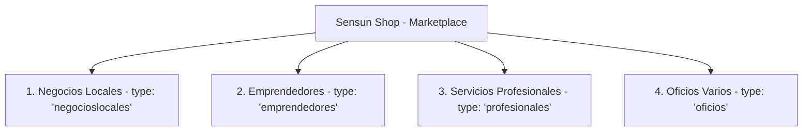

# Estructura del Mapa y Taxonomía: Sensun Shop (Guía de Arquitectura para Android Studio)

Este documento es la **guía maestra de navegación, taxonomía de categorías, subcategorías, etiquetas (tags), diseño y flujos de usuario** para la aplicación nativa en Android Studio.

---

## 1. Módulos / Secciones Principales de la Aplicación (`type`)

Sensun Shop organiza su ecosistema comercial en **4 macro-secciones**:



| Tipo / Sección (`type`) | Título en Pantalla | Propósito | Color Temático |
| :--- | :--- | :--- | :--- |
| **`negocioslocales`** | Negocios Locales | Comercios y locales establecidos en Sensuntepeque | Naranja (`#f39c12`) |
| **`emprendedores`** | Emprendedores | Marcas emergentes, productos artesanales y tecnología | Naranja/Cian (`#f39c12` / `#00adb5`) |
| **`profesionales`** | Servicios Profesionales | Médicos, dentistas, abogados y consultores | Morado/Naranja (`#8e44ad` / `#f39c12`) |
| **`oficios`** | Oficios y Servicios | Técnicos de mantenimiento, fontanería, electricidad, etc. | Amarillo/Naranja (`#f1c40f`) |

---

## 2. Mapa de Categorías y Subcategorías por Sección

### A. Negocios Locales (`type: "negocioslocales"`)

#### Categorías Principales (Chips de Filtrado Superior)
* **`all`**: "Todos los Negocios" *(Mostrar todo el catálogo)*
* **`comida`**: "Comida y Restaurantes" *(Pupuserías, taquerías, cafeterías, parrilladas)*
* **`comercio`**: "Tiendas y Comercio" *(Lácteos, ropa, tecnología, variedades)*
* **`servicios`**: "Servicios Locales" *(Pintura, rotulación, fotografía, imprenta)*
* **`artesanias`**: "Artesanías y Hogar" *(Manualidades, decoraciones, muebles)*

#### Subcategorías (Menú Desplegable de Filtro Fino)
* `restaurante`: Restaurantes
* `pupusas`: Pupuserías & Comedores
* `cafe`: Cafetería & Café Gourmet
* `taco`: Tacos & Comida Mexicana
* `lacteos`: Lácteos & Derivados
* `fotografia`: Fotografía & Estudio
* `artesanias`: Artesanías
* `moda`: Moda & Calzado
* `hogar`: Hogar & Decoración
* `salud`: Salud & Farmacias
* `joyeria`: Joyería & Accesorios
* `plantas`: Viveros & Plantas
* `mercado`: Productos de Mercado
* `alojamiento`: Hoteles & Alojamiento

---

### B. Emprendedores (`type: "emprendedores"`)

#### Categorías Principales
* **`all`**: "Todos los Emprendedores"
* **`servicios`**: "Servicios & Tecnología"
* **`artesanias`**: "Artesanías & Productos"
* **`gastronomia`**: "Gastronomía & Alimentos"

#### Subcategorías
* `tecnologia`: Telefonía, Chips, Recargas e Internet
* `servicios-creativos`: Diseño Gráfico, Publicidad y Web
* `hecho-a-mano`: Productos Artesanales Hechos a Mano
* `moda-diseno`: Ropa, Sublimación y Accesorios
* `encomendistas`: Envíos y Encomiendas Locales/Internacionales
* `otros`: Nuevas Iniciativas

---

### C. Servicios Profesionales (`type: "profesionales"`)

#### Categorías Principales
* **`all`**: "Todos los Profesionales"
* **`salud`**: "Salud & Medicina"
* **`graduados`**: "Graduados & Universitarios"
* **`tecnicos`**: "Técnicos & Especialistas"

#### Subcategorías
* `salud`: Médicos Generales, Pediatría y Clínicas
* `odontologia` / `ortodoncia`: Dentistas y Especialistas Maxilofaciales
* `leyes`: Abogados y Notarios
* `tecnologia`: Ingenieros en Sistemas y Desarrolladores
* `educacion`: Profesores y Asesorías Académicas
* `otros`: Consultoría Empresarial

---

## 3. Diccionario Completo de Etiquetas (`tags`) para el Buscador

Para que el motor de búsqueda en Android responda a cualquier término que el usuario escriba, este es el glosario de tags asignados:

```json
{
  "comida_y_bebidas": [
    "comida", "restaurante", "pupusas", "pupuseria", "tacos", "taco", 
    "mexicana", "bistro", "cafe", "cafeteria", "gourmet", "postres", 
    "almuerzos", "cenas", "parrilladas", "carne", "alitas", "hamburguesas", 
    "mariscos", "bebidas", "lacteos", "queso", "crema", "mantequilla", "quesillo"
  ],
  "salud_y_medicina": [
    "salud", "medico", "medicina", "clinica", "consultorio", "consulta", 
    "emergencias", "doctor", "odontologia", "ortodoncia", "dientes", 
    "sonrisas", "dentista", "salud dental"
  ],
  "tecnologia_y_creativos": [
    "tecnologia", "telefonia", "chips", "recargas", "paquetes", "internet", 
    "desarrollo web", "paginas web", "marketing", "publicidad", "diseno", 
    "rotulos", "rotulacion", "pintura", "fachadas", "imprenta", "sublimacion", 
    "fotografia", "estudio fotografico", "sesiones", "eventos", "bodas", 
    "xv anos", "graduaciones", "retratos"
  ],
  "comercio_y_servicios": [
    "comercio", "tienda", "servicios", "profesionales", "artesanias", 
    "eventos", "restaurante familiar", "servicio a domicilio", "delivery"
  ]
}
```

---

## 4. Estructura de un Objeto de Negocio en Firebase RTDB (`sensunshop/businesses`)

```json
{
  "id": "arphotostudio",
  "code": "NEG-008",
  "title": "A&R Photo Studio",
  "type": "negocioslocales",
  "category": "servicios",
  "badge": "FOTOGRAFÍA & ESTUDIO",
  "description": "Estudio de Fotografía Profesional: Especialistas en fotografía en estudio, bodas, XV años, graduaciones...",
  "imgSrc": "https://res.cloudinary.com/dn6fmqae9/image/upload/v1786823215/Logo_A_R_Dorado_zfajdw.webp",
  "gallery": [
    "https://res.cloudinary.com/dn6fmqae9/image/upload/v1786823215/Logo_A_R_Dorado_zfajdw.webp"
  ],
  "whatsapp": "50372300795",
  "whatsappMsg": "Hola A&R Photo Studio, vengo desde Sensun Shop",
  "locationUrl": "https://maps.app.goo.gl/MCJrgQUBBiQtSaeh8",
  "websiteUrl": "https://ar-photostudio.com",
  "accentColor": "#f39c12",
  "tags": [
    "fotografia", "estudio fotografico", "sesiones", "eventos", 
    "bodas", "xv anos", "retratos", "servicios", "profesionales"
  ],
  "isActive": true
}
```

---

## 5. Componentes y UI recomendada para Android Studio

### 1. **Pantalla Principal (Home / Feed)**
* **Header de Marca**: Logo Sensun Shop, botón de Búsqueda global, botón de Perfil de usuario (avatar dinámico).
* **Novedades (Slider Carousel)**: Tarjetas destacadas horizontales (`gallery` / banner principal) con auto-scroll o scroll-snap.
* **Barra de Navegación por Pestañas (Bottom Navigation o Tabs)**:
  1. 🏪 *Locales* (`type: negocioslocales`)
  2. 🚀 *Emprendedores* (`type: emprendedores`)
  3. 🎓 *Profesionales* (`type: profesionales`)
  4. ❤️ *Favoritos* (Lista guardada en `users/<uid>/sensunshop_favorites`)
* **Barra de Filtros Horizontales (Horizontal ChipGroup)**: Chips de categorías (`all`, `comida`, `comercio`, etc.) + Botón Dropdown de Subcategorías.
* **Cuadrícula de Tarjetas (RecyclerView con GridLayoutManager o StaggeredGrid)**:
  - 2 columnas en móvil o 1 columna expandida.

---

### 2. **Anatomía de la Tarjeta de Negocio (`BusinessCardView`)**
Cada tarjeta de negocio debe mostrar:
1. **Imagen / Logo**: Cargar `imgSrc` con *Glide* o *Coil* (con borde redondeado y placeholder).
2. **Badge de Categoría**: Etiqueta superior coloreada según `accentColor`.
3. **Nombre del Negocio**: Texto destacado (`title`).
4. **Widget de Calificación (5 Estrellas)**:
   - Estrellas interactivas: Si el usuario pulsa una estrella y está logueado, guarda su voto en `sensunshop/ratings/<id>/<uid>`.
   - Promedio y cantidad de votos (ej: `4.8 ★ (12)`).
5. **Botón Circular de Comentarios (Burbuja con Badge numérico)**:
   - Muestra la cantidad de comentarios en tiempo real de `comments/<id>`.
   - Al pulsar, abre el diálogo/bottom sheet de comentarios anónimos.
6. **Botón Favorito (Icono de Estrella/Corazón)**:
   - Al pulsar, guarda o elimina en `users/<uid>/sensunshop_favorites/<id>`.
7. **Botones de Acción Rápida**:
   - 🟢 **WhatsApp**: Dispara el intent con el número `whatsapp` y mensaje `whatsappMsg`.
   - 🔴 **Ubicación**: Abre Google Maps mediante `locationUrl`.
   - 🌐 **Web / Detalles**: Abre el navegador si tiene `websiteUrl`.

---

### 3. **Modal / Bottom Sheet de Comentarios Anónimos**
* **Cabecera**: Nombre del negocio e icono 💬.
* **Lista de Comentarios (RecyclerView)**:
  - Avatar anónimo (`👤`).
  - Nombre: *"Usuario Anónimo"*.
  - Si el comentario pertenece al usuario actual (`uid == currentUser.uid`), resaltar con borde dorado y badge *"Tu comentario"*.
  - Botones de **Editar (✏️)** y **Eliminar (🗑️)** únicamente para los comentarios propios.
* **Control Anti-Spam (1 comentario por usuario)**:
  - Si el usuario ya comentó en este negocio, el formulario de escritura se oculta y muestra: *"Ya has publicado tu comentario. Puedes editarlo o eliminarlo arriba."*
  - Si no está logueado, muestra botón *"Iniciar Sesión para comentar"*.

---

### 4. **Modal / Pantalla de Perfil de Usuario**
* **Avatar Dinámico**:
  - Si `photoURL` es enlace HTTPS (Cloudinary/Drive), renderizar foto circular.
  - Si `photoURL` es string `"male1|#3498db"`, dibujar el SVG/Vector correspondiente con el color hexadecimal de fondo.
* **Información**: Nombre completo y Correo.
* **Sección de Favoritos**: Botón para abrir el listado de todos sus negocios guardados.
* **Acciones de Cuenta**: Cerrar sesión (`signOut`) y Eliminar cuenta (`deleteUser`).

---

## 6. Paleta de Colores y Tokens Visuales (UI Kit Android)

```xml
<!-- colors.xml -->
<resources>
    <!-- Colores de Marca Sensun Shop -->
    <color name="sensun_orange">#F39C12</color>
    <color name="sensun_orange_dark">#D35400</color>
    <color name="sensun_purple">#8E44AD</color>
    <color name="sensun_cyan">#00ADB5</color>
    <color name="sensun_gold">#FFB703</color>

    <!-- Fondos Dark Mode Premium -->
    <color name="bg_main">#0A0D14</color>
    <color name="bg_card">#121724</color>
    <color name="bg_card_secondary">#182030</color>
    <color name="bg_card_border">#1FFFFFFF</color>

    <!-- Textos -->
    <color name="text_white">#FFFFFF</color>
    <color name="text_gray_light">#CBD5E1</color>
    <color name="text_gray_muted">#718096</color>

    <!-- Acciones -->
    <color name="action_whatsapp">#25D366</color>
    <color name="action_maps">#EA4335</color>
    <color name="action_delete">#E74C3C</color>
</resources>
```

---

## 7. Lógica del Algoritmo de Búsqueda y Filtrado en Android (Kotlin)

```kotlin
fun filterBusinesses(
    originalList: List<Business>,
    selectedType: String,      // "all", "negocioslocales", "emprendedores", "profesionales"
    selectedCategory: String,  // "all", "comida", "comercio", "servicios", etc.
    selectedSubtag: String,    // "all", "fotografia", "pupusas", "lacteos", etc.
    searchQuery: String        // Texto ingresado en la barra de búsqueda
): List<Business> {
    val query = searchQuery.trim().lowercase().normalize()

    return originalList.filter { business ->
        // 1. Filtro de tipo / sección
        val matchType = selectedType == "all" || business.type == selectedType

        // 2. Filtro de categoría principal
        val matchCategory = selectedCategory == "all" || business.category == selectedCategory

        // 3. Filtro de subcategoría / tag
        val matchSubtag = selectedSubtag == "all" || business.tags.any { it.normalize() == selectedSubtag.normalize() }

        // 4. Búsqueda de texto libre (título, descripción, tags, categoría, badge)
        val matchQuery = if (query.isEmpty()) {
            true
        } else {
            business.title.normalize().contains(query) ||
            business.description.normalize().contains(query) ||
            business.badge.normalize().contains(query) ||
            business.category.normalize().contains(query) ||
            business.tags.any { it.normalize().contains(query) }
        }

        matchType && matchCategory && matchSubtag && matchQuery && business.isActive
    }
}

// Helper para normalizar acentos y caracteres especiales
fun String.normalize(): String {
    return java.text.Normalizer.normalize(this, java.text.Normalizer.Form.NFD)
        .replace("\\p{InCombiningDiacriticalMarks}+".toRegex(), "")
        .lowercase()
        .trim()
}
```
