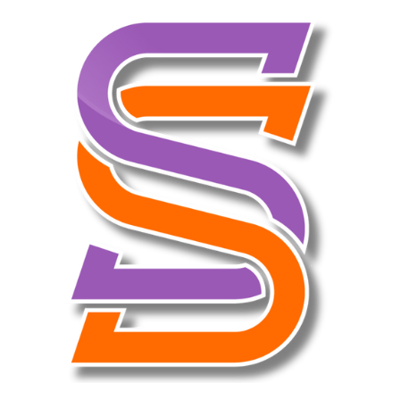

# 🪟 Registro y Catálogo de Ventanas Emergentes, Modales y Alertas

Este documento reúne las especificaciones técnicas, estilos CSS, marcado HTML, lógica JavaScript y variables de personalización para **10 tipos avanzados de ventanas emergentes, modales, alertas y menús interactivos**.

---

## 📑 Índice Rápido

1. [Tokens Globales y Sistema de Superposición (Overlay)](#-tokens-globales-y-sistema-de-superposición-overlay)
2. [Sistema Base de Toast / Notificaciones Flotantes](#-sistema-base-de-toast--notificaciones-flotantes)
3. [Catálogo de Componentes](#-catálogo-de-componentes)
   - [07. Notificación Push Flotante (Estilo iOS)](#07-notificación-push-flotante-estilo-ios-push)
   - [08. Foco Guiado / Spotlight Coach Mark](#08-foco-guiado--spotlight-coach-mark-sp)
   - [09. Modal de Recompensa con Lluvia de Confeti](#09-modal-de-recompensa-con-lluvia-de-confeti-rw-card)
   - [10. Ticket / Cupón con Borde Dentado y Código de Barras](#10-ticket--cupón-con-borde-dentado-tk-card)
   - [11. Modal de Calificación con Estrellas y Emojis Reactivos](#11-modal-de-calificación-con-estrellas-rt-card)
   - [12. Visor de Historias / Stories con Barras de Progreso](#12-visor-de-historias--stories-st-panel)
   - [13. Tarjeta Giratoria 3D (Flip Card Interactiva)](#13-tarjeta-giratoria-3d-flip)
   - [14. Diálogo de Carga a Éxito con Checkmark SVG Animado](#14-diálogo-de-carga-a-éxito-ld-card)
   - [15. Menú Flotante Radial (FAB Abanico Desplegable)](#15-menú-flotante-radial-fab-wrap)
   - [16. Carrusel Inferior de Bienvenida (Onboarding Stepper)](#16-carrusel-inferior-de-bienvenida-stp-sheet)
   - [17. Campana FAB Notificadora con Popup y Animación de Encogimiento](#17-campana-fab-notificadora-con-popup-y-animación-de-encogimiento-sensun-bell-fab)
   - [18. Centro de Notificaciones Multicategoría con Campanas Reactivas](#18-centro-de-notificaciones-multicategoría-con-campanas-reactivas-bell-grid)
4. [Guía de Integración y Buenas Prácticas](#-guía-de-integración-y-buenas-prácticas)

---

## ⚡ Tokens Globales y Sistema de Superposición (Overlay)

### Variables CSS Base
```css
:root {
  /* Escala cálida (Orange / Sensun) */
  --n50: #fff7ed; --n100: #ffedd5; --n200: #fed7aa; --n300: #fdba74;
  --n400: #fb923c; --n500: #f97316; --n600: #ea580c; --n700: #c2410c;
  --n800: #9a3412; --n900: #7c2d12;
  
  --ink: #2b1608;
  --muted: #a18873;
  --bg: #fdf8f2;
  
  /* Curvas de Aceleración */
  --ease: cubic-bezier(.22, 1, .36, 1);
  --spring: cubic-bezier(.32, 1.25, .4, 1);
  --shadow: 0 10px 30px rgba(194, 65, 12, .10);
}
```

### Estructura Base del Overlay (`.ov`)
Todos los modales centrados o inferiores se montan sobre esta estructura contenedora con desenfoque de fondo (*backdrop-filter*):

```css
.ov {
  position: fixed;
  inset: 0;
  z-index: 80;
  opacity: 0;
  pointer-events: none;
  transition: opacity .32s ease;
}

.ov.open {
  opacity: 1;
  pointer-events: auto;
}

.ov .bd {
  position: absolute;
  inset: 0;
  background: rgba(43, 22, 8, .45);
  backdrop-filter: blur(6px);
}

.ov .frame {
  position: absolute;
  top: 0; bottom: 0;
  left: 50%;
  transform: translateX(-50%);
  width: min(430px, 100vw);
}

.center {
  position: absolute;
  inset: 0;
  display: flex;
  align-items: center;
  justify-content: center;
  padding: 26px;
}
```

---

## 🍞 Sistema Base de Toast / Notificaciones Flotantes

Un mensaje flotante ligero tipo píldora que se despliega desde la parte superior.

### 🧱 HTML
```html
<div class="toast" id="toast"></div>
```

### 🎨 CSS
```css
.toast {
  position: fixed;
  top: 18px;
  left: 50%;
  transform: translate(-50%, -90px);
  z-index: 100;
  background: rgba(43, 22, 8, .88);
  backdrop-filter: blur(8px);
  color: #fff;
  font-size: 13px;
  font-weight: 700;
  padding: 12px 22px;
  border-radius: 99px;
  box-shadow: 0 14px 30px rgba(0, 0, 0, .3);
  transition: transform .45s var(--spring);
  pointer-events: none;
  max-width: 88vw;
  text-align: center;
}

.toast.show {
  transform: translate(-50%, 0);
}
```

### ⚙️ JavaScript
```javascript
const toastEl = document.getElementById('toast');
let toastTimer = null;

function showToast(mensaje, duracion = 2200) {
  toastEl.textContent = mensaje;
  toastEl.classList.add('show');
  clearTimeout(toastTimer);
  toastTimer = setTimeout(() => toastEl.classList.remove('show'), duracion);
}
```

---

## 📦 Catálogo de Componentes

---

### 07. Notificación Push Flotante (Estilo iOS) (`.push`)
> **Uso recomendado**: Avisos de promociones urgentes, nuevos pedidos, alertas de mensajes directos en tiempo real sin bloquear la vista.

#### 🧱 HTML
```html
<div class="push" id="pushBox">
  <div class="p-ico">S</div>
  <div class="p-body">
    <b>Sensun Shop <small>ahora</small></b>
    <p>🎉 ¡Nueva oferta en Café La Plaza: -20% hoy!</p>
  </div>
  <button class="p-act" id="pushAct">Ver</button>
</div>
```

#### 🎨 CSS
```css
.push {
  position: fixed;
  top: 14px;
  left: 50%;
  transform: translate(-50%, -150%);
  width: min(392px, calc(100vw - 22px));
  background: rgba(255, 255, 255, .92);
  backdrop-filter: blur(14px);
  border-radius: 22px;
  padding: 13px 14px;
  display: flex;
  gap: 11px;
  align-items: center;
  box-shadow: 0 16px 44px rgba(43, 22, 8, .3);
  z-index: 95;
  transition: transform .6s var(--spring);
}

.push.show {
  transform: translate(-50%, 0);
}

.p-ico {
  width: 42px;
  height: 42px;
  border-radius: 13px;
  background: linear-gradient(135deg, var(--n400), var(--n600));
  color: #fff;
  font-weight: 800;
  font-size: 18px;
  display: grid;
  place-items: center;
  flex-shrink: 0;
}

.p-body { flex: 1; min-width: 0; }
.p-body b { font-size: 12.5px; font-weight: 800; display: flex; justify-content: space-between; }
.p-body b small { color: var(--muted); font-weight: 600; font-size: 10px; }
.p-body p {
  font-size: 11.5px;
  color: #6b4c36;
  font-weight: 600;
  margin-top: 2px;
  white-space: nowrap;
  overflow: hidden;
  text-overflow: ellipsis;
}

.p-act {
  border: none;
  cursor: pointer;
  font-size: 11.5px;
  font-weight: 800;
  color: var(--n600);
  background: var(--n50);
  padding: 9px 13px;
  border-radius: 12px;
  flex-shrink: 0;
}
```

#### ⚙️ JavaScript
```javascript
let pushTimer = null;

function triggerPush(titulo, texto, accionTexto = 'Ver', callback) {
  const pushBox = document.getElementById('pushBox');
  pushBox.classList.add('show');
  
  clearTimeout(pushTimer);
  pushTimer = setTimeout(() => pushBox.classList.remove('show'), 4500);
}

document.getElementById('pushAct').addEventListener('click', () => {
  document.getElementById('pushBox').classList.remove('show');
  showToast('🎉 Abriendo oferta…');
});
```

---

### 08. Foco Guiado / Spotlight Coach Mark (`.sp`)
> **Uso recomendado**: Onboarding interactivo, guías paso a paso para nuevas funciones o destacar botones importantes. Utiliza una técnica de máscara con sombra infinita `box-shadow: 0 0 0 3000px`.

#### 🧱 HTML
```html
<div class="sp" id="ovSpot">
  <!-- El orificio luminoso -->
  <div class="sp-hole" id="spHole"></div>
  
  <!-- El tooltip explicativo -->
  <div class="sp-tip" id="spTip">
    <h4>💡 Guarda tus favoritos</h4>
    <p>Toca el corazón para guardar cualquier negocio en tu lista y tenerlo siempre a la mano.</p>
    <button id="spOk">¡Entendido!</button>
  </div>
</div>
```

#### 🎨 CSS
```css
.sp {
  position: fixed;
  inset: 0;
  z-index: 85;
  opacity: 0;
  pointer-events: none;
  transition: opacity .3s;
}
.sp.open { opacity: 1; pointer-events: auto; }

/* El agujero de luz que oscurece el resto de la pantalla */
.sp-hole {
  position: fixed;
  border-radius: 17px;
  box-shadow: 0 0 0 3000px rgba(30, 15, 5, .7);
  transition: all .5s var(--ease);
  z-index: 1;
}

/* Anillo palpitante de atención */
.sp-hole::after {
  content: "";
  position: absolute;
  inset: -7px;
  border-radius: 21px;
  border: 2.5px solid var(--n400);
  animation: ringPulse 1.6s infinite;
}
@keyframes ringPulse {
  0% { transform: scale(.9); opacity: 1; }
  100% { transform: scale(1.3); opacity: 0; }
}

.sp-tip {
  position: fixed;
  left: 50%;
  transform: translateX(-50%);
  width: min(320px, 86vw);
  background: #fff;
  border-radius: 22px;
  padding: 18px;
  z-index: 2;
  box-shadow: 0 24px 60px rgba(0, 0, 0, .35);
  text-align: center;
}
.sp-tip h4 { font-size: 15px; font-weight: 800; margin-bottom: 6px; }
.sp-tip p { font-size: 12px; color: #6b4c36; font-weight: 500; line-height: 1.55; margin-bottom: 14px; }
.sp-tip button {
  border: none;
  cursor: pointer;
  font-size: 13px;
  font-weight: 800;
  color: #fff;
  background: linear-gradient(135deg, var(--n400), var(--n600));
  padding: 12px 26px;
  border-radius: 14px;
  box-shadow: 0 8px 18px rgba(234, 88, 12, .4);
}
```

#### ⚙️ JavaScript
```javascript
function focusElement(targetElementSelector) {
  const target = document.querySelector(targetElementSelector);
  if (!target) return;
  
  const ovSpot = document.getElementById('ovSpot');
  ovSpot.classList.add('open');
  
  requestAnimationFrame(() => {
    const r = target.getBoundingClientRect();
    const h = document.getElementById('spHole');
    h.style.left = (r.left - 9) + 'px';
    h.style.top = (r.top - 9) + 'px';
    h.style.width = (r.width + 18) + 'px';
    h.style.height = (r.height + 18) + 'px';
    document.getElementById('spTip').style.top = (r.bottom + 26) + 'px';
  });
}

document.getElementById('spOk').addEventListener('click', () => {
  document.getElementById('ovSpot').classList.remove('open');
});
```

---

### 09. Modal de Recompensa con Lluvia de Confeti (`.rw-card`)
> **Uso recomendado**: Cupones ganados, desbloqueo de niveles de fidelidad, felicitaciones por registro o compra exitosa.

#### 🧱 HTML
```html
<div class="ov" id="ovConfetti">
  <div class="bd" data-close="ovConfetti"></div>
  <div class="cf-box" id="cfBox"></div>
  <div class="frame">
    <div class="center">
      <div class="rw-card">
        <div class="rw-emoji">🎁</div>
        <h3>¡Ganaste un premio!</h3>
        <p>Por apoyar lo local, tienes un descuento especial en tu próxima visita.</p>
        <div class="rw-code">SENSUN20</div>
        <button class="rw-cta" data-close="ovConfetti" data-msg="🎟️ Premio guardado en tu perfil">Reclamar ahora</button>
      </div>
    </div>
  </div>
</div>
```

#### 🎨 CSS
```css
.cf-box {
  position: absolute;
  inset: 0;
  overflow: hidden;
  pointer-events: none;
  z-index: 1;
}

.cf-piece {
  position: absolute;
  top: -16px;
  border-radius: 2px;
  animation: cfFall linear forwards;
}
@keyframes cfFall {
  to { transform: translateY(108vh) rotate(760deg); }
}

.rw-card {
  position: relative;
  width: min(320px, 88vw);
  background: #fff;
  border-radius: 30px;
  padding: 30px 24px;
  text-align: center;
  box-shadow: 0 30px 80px rgba(0, 0, 0, .35);
  transform: scale(.8);
  opacity: 0;
  transition: transform .5s var(--spring) .1s, opacity .3s .1s;
  z-index: 2;
}

.ov.open .rw-card {
  transform: none;
  opacity: 1;
}

.rw-emoji {
  font-size: 64px;
  animation: bounceEmoji 1.4s ease-in-out infinite;
}
@keyframes bounceEmoji {
  0%, 100% { transform: translateY(0); }
  50% { transform: translateY(-12px); }
}

.rw-card h3 { font-size: 19px; font-weight: 800; margin: 10px 0 6px; }
.rw-card p { font-size: 12.5px; color: #6b4c36; font-weight: 500; line-height: 1.6; margin-bottom: 16px; }
.rw-code {
  display: inline-block;
  border: 2px dashed var(--n300);
  background: var(--n50);
  color: var(--n600);
  font-weight: 800;
  font-size: 15px;
  letter-spacing: 2px;
  padding: 10px 22px;
  border-radius: 14px;
  margin-bottom: 18px;
}
.rw-cta {
  width: 100%;
  border: none;
  cursor: pointer;
  font-size: 14px;
  font-weight: 800;
  color: #fff;
  background: linear-gradient(135deg, var(--n400), var(--n600));
  padding: 14px;
  border-radius: 16px;
  box-shadow: 0 10px 24px rgba(234, 88, 12, .4);
}
```

#### ⚙️ JavaScript
```javascript
function launchConfettiReward() {
  const box = document.getElementById('cfBox');
  box.innerHTML = '';
  const colores = ['#fb923c', '#f97316', '#fbbf24', '#a855f7', '#22c55e', '#ef4444', '#60a5fa', '#f472b6'];
  
  for (let i = 0; i < 55; i++) {
    const p = document.createElement('i');
    p.className = 'cf-piece';
    p.style.left = Math.random() * 100 + '%';
    p.style.background = colores[Math.floor(Math.random() * colores.length)];
    p.style.width = (6 + Math.random() * 7) + 'px';
    p.style.height = (10 + Math.random() * 8) + 'px';
    p.style.animationDuration = (1.5 + Math.random() * 1.3) + 's';
    p.style.animationDelay = (Math.random() * .5) + 's';
    box.appendChild(p);
  }
  
  document.getElementById('ovConfetti').classList.add('open');
}
```

---

### 10. Ticket / Cupón con Borde Dentado (`.tk-card`)
> **Uso recomendado**: Cupones canjeables en caja, entradas de eventos, pases de fidelidad con código de barras generado por CSS.

#### 🧱 HTML
```html
<div class="ov" id="ovTicket">
  <div class="bd" data-close="ovTicket"></div>
  <div class="frame">
    <div class="center">
      <div class="tk-card">
        <div class="tk-top">
          <small>CUPÓN ESPECIAL</small>
          <h2>-20%</h2>
        </div>
        <div class="tk-body">
          <h4>Válido en Café La Plaza</h4>
          <p>Muestra este código al pagar · hasta el 30 de junio</p>
          <!-- Código de barras simulado -->
          <div class="tk-bars" id="tkBars"></div>
          <button class="tk-cta" data-close="ovTicket" data-msg="🎟️ Cupón canjeado ✓">Canjear cupón</button>
        </div>
      </div>
    </div>
  </div>
</div>
```

#### 🎨 CSS
```css
.tk-card {
  width: min(320px, 88vw);
  background: #fff;
  border-radius: 24px;
  overflow: hidden;
  box-shadow: 0 30px 80px rgba(0, 0, 0, .35);
  transform: scale(.8) rotate(-4deg);
  opacity: 0;
  transition: transform .55s var(--spring) .05s, opacity .3s .05s;
}
.ov.open .tk-card { transform: none; opacity: 1; }

.tk-top {
  background: linear-gradient(130deg, var(--n400), var(--n600));
  color: #fff;
  padding: 22px;
  text-align: center;
  position: relative;
}

/* Efecto de borde dentado (Dientes de sierra / Zig-Zag) */
.tk-top::after {
  content: "";
  position: absolute;
  bottom: -1px;
  left: 0; right: 0;
  height: 12px;
  background: linear-gradient(45deg, #fff 50%, transparent 50%) repeat-x,
              linear-gradient(-45deg, #fff 50%, transparent 50%) repeat-x;
  background-size: 14px 14px;
  background-position: 0 0;
}

.tk-top small { font-size: 10px; font-weight: 800; letter-spacing: 2px; opacity: .9; }
.tk-top h2 { font-size: 40px; font-weight: 800; line-height: 1.1; }

.tk-body { padding: 20px 22px 22px; text-align: center; }
.tk-body h4 { font-size: 15px; font-weight: 800; margin-bottom: 5px; }
.tk-body p { font-size: 11.5px; color: var(--muted); font-weight: 600; margin-bottom: 15px; }

.tk-bars { display: flex; justify-content: center; gap: 3px; margin-bottom: 16px; }
.tk-bars i { width: 3px; background: var(--ink); border-radius: 2px; display: block; }

.tk-cta {
  width: 100%;
  border: none;
  cursor: pointer;
  font-size: 13.5px;
  font-weight: 800;
  color: var(--n600);
  background: var(--n50);
  border: 1.5px solid var(--n200);
  padding: 13px;
  border-radius: 15px;
}
```

#### ⚙️ JavaScript
```javascript
// Generador de líneas de código de barras
(function renderBarcode() {
  const container = document.getElementById('tkBars');
  if (!container) return;
  container.innerHTML = '';
  for (let i = 0; i < 28; i++) {
    const bar = document.createElement('i');
    bar.style.height = (12 + Math.random() * 16) + 'px';
    container.appendChild(bar);
  }
})();
```

---

### 11. Modal de Calificación con Estrellas (`.rt-card`)
> **Uso recomendado**: Reseñas post-servicio, valoraciones de compras, retroalimentación del cliente con cambio dinámico de emoji y textos reactivos.

#### 🧱 HTML
```html
<div class="ov" id="ovRate">
  <div class="bd" data-close="ovRate"></div>
  <div class="frame">
    <div class="center">
      <div class="rt-card">
        <div class="rt-face" id="rtFace">😊</div>
        <h3>¿Cómo estuvo tu experiencia?</h3>
        <p>Tu opinión ayuda a los negocios locales a mejorar.</p>
        <div class="rt-stars" id="rtStars"></div>
        <div class="rt-label" id="rtLabel"></div>
        <button class="rt-send" id="rtSend">Enviar calificación</button>
      </div>
    </div>
  </div>
</div>
```

#### 🎨 CSS
```css
.rt-card {
  width: min(320px, 88vw);
  background: #fff;
  border-radius: 30px;
  padding: 28px 22px;
  text-align: center;
  box-shadow: 0 30px 80px rgba(0, 0, 0, .35);
  transform: scale(.8) translateY(24px);
  opacity: 0;
  transition: transform .5s var(--spring), opacity .3s;
}
.ov.open .rt-card { transform: none; opacity: 1; }

.rt-face {
  font-size: 56px;
  margin-bottom: 8px;
  transition: transform .3s var(--spring);
}
.rt-card h3 { font-size: 17px; font-weight: 800; margin-bottom: 5px; }
.rt-card > p { font-size: 12px; color: var(--muted); font-weight: 600; margin-bottom: 16px; }

.rt-stars { display: flex; justify-content: center; gap: 8px; margin-bottom: 8px; }
.rt-star { border: none; background: none; cursor: pointer; padding: 4px; transition: transform .2s var(--spring); }
.rt-star:active { transform: scale(.8); }
.rt-star svg {
  width: 34px; height: 34px;
  stroke: #e7d7c8; fill: none; stroke-width: 1.8; stroke-linejoin: round;
  transition: all .25s;
}
.rt-star.on svg {
  fill: #f59e0b; stroke: #f59e0b;
  animation: starPop .4s cubic-bezier(.34, 1.56, .64, 1);
}
@keyframes starPop {
  from { transform: scale(.4) rotate(-20deg); }
  to { transform: scale(1); }
}

.rt-label { font-size: 12px; font-weight: 800; color: var(--n600); min-height: 18px; margin-bottom: 14px; }
.rt-send {
  width: 100%;
  border: none;
  cursor: pointer;
  font-size: 14px;
  font-weight: 800;
  color: #fff;
  background: linear-gradient(135deg, var(--n400), var(--n600));
  padding: 14px;
  border-radius: 16px;
  opacity: .45;
  pointer-events: none;
  transition: opacity .3s;
}
.rt-send.ready {
  opacity: 1;
  pointer-events: auto;
  box-shadow: 0 10px 24px rgba(234, 88, 12, .4);
}
```

#### ⚙️ JavaScript
```javascript
const caras = ['😊', '😞', '😕', '🙂', '😄', '😍'];
const textos = ['', 'Mala 😔', 'Regular 😕', 'Buena 🙂', '¡Genial! 😄', '¡Excelente! 😍'];
let puntuacionSeleccionada = 0;

const starsWrap = document.getElementById('rtStars');
for (let i = 1; i <= 5; i++) {
  const btn = document.createElement('button');
  btn.className = 'rt-star';
  btn.innerHTML = `<svg viewBox="0 0 24 24"><polygon points="12 2 15.09 8.26 22 9.27 17 14.14 18.18 21.02 12 17.77 5.82 21.02 7 14.14 2 9.27 8.91 8.26 12 2"/></svg>`;
  
  btn.addEventListener('click', () => {
    puntuacionSeleccionada = i;
    starsWrap.querySelectorAll('.rt-star').forEach((s, k) => s.classList.toggle('on', k < i));
    
    const face = document.getElementById('rtFace');
    face.textContent = caras[i];
    face.style.transform = 'scale(1.15)';
    setTimeout(() => face.style.transform = '', 200);
    
    document.getElementById('rtLabel').textContent = textos[i];
    document.getElementById('rtSend').classList.add('ready');
  });
  starsWrap.appendChild(btn);
}

document.getElementById('rtSend').addEventListener('click', () => {
  document.getElementById('ovRate').classList.remove('open');
  showToast(`⭐ Gracias por calificar con ${puntuacionSeleccionada} estrellas`);
});
```

---

### 12. Visor de Historias / Stories (`.st-panel`)
> **Uso recomendado**: Historias de ofertas temporales, destacados diarios, avisos express de negocios al estilo Instagram.

#### 🧱 HTML
```html
<div class="ov" id="ovStory">
  <div class="frame">
    <div class="st-panel" id="stPanel">
      <div class="st-bars" id="stBars"></div>
      <div class="st-user">
        <div class="u-ava">S</div>
        <div>
          <b>Sensun Shop</b>
          <small id="stTime">hace 2 h</small>
        </div>
        <button class="st-close" data-close="ovStory">
          <svg viewBox="0 0 24 24"><line x1="18" y1="6" x2="6" y2="18"/><line x1="6" y1="6" x2="18" y2="18"/></svg>
        </button>
      </div>
      <div class="st-content">
        <div class="st-emoji" id="stEmoji">🧡</div>
        <h2 id="stTitle"></h2>
        <p id="stText"></p>
      </div>
      <!-- Zonas invisibles de toque izquierda / derecha -->
      <button class="st-tap l" id="stPrev" aria-label="Anterior"></button>
      <button class="st-tap r" id="stNext" aria-label="Siguiente"></button>
    </div>
  </div>
</div>
```

#### 🎨 CSS
```css
.st-panel {
  position: absolute;
  inset: 0;
  background: linear-gradient(160deg, var(--s1, #f97316), var(--s2, #c2410c));
  display: flex;
  flex-direction: column;
  padding: 14px 16px;
  transform: translateY(102%);
  transition: transform .55s var(--spring);
}
.ov.open .st-panel { transform: none; }

.st-bars { display: flex; gap: 6px; margin-bottom: 14px; }
.st-bar { flex: 1; height: 3.5px; border-radius: 99px; background: rgba(255, 255, 255, .35); overflow: hidden; }
.st-bar i { display: block; height: 100%; width: 0; background: #fff; border-radius: 99px; }

.st-user { display: flex; align-items: center; gap: 10px; color: #fff; z-index: 2; }
.st-user .u-ava {
  width: 38px; height: 38px; border-radius: 50%;
  background: rgba(255, 255, 255, .25); display: grid; place-items: center;
  font-weight: 800; backdrop-filter: blur(4px);
}
.st-user b { font-size: 13px; }
.st-user small { display: block; font-size: 10px; opacity: .8; }

.st-close {
  margin-left: auto; width: 36px; height: 36px; border: none; border-radius: 12px;
  background: rgba(255, 255, 255, .2); color: #fff; cursor: pointer; display: grid; place-items: center;
}
.st-close svg { width: 15px; height: 15px; stroke: currentColor; fill: none; stroke-width: 2.5; stroke-linecap: round; }

.st-content {
  flex: 1; display: flex; flex-direction: column;
  align-items: center; justify-content: center; text-align: center; color: #fff; padding: 0 24px;
}
.st-content .st-emoji { font-size: 80px; margin-bottom: 16px; }
.st-content h2 { font-size: 23px; font-weight: 800; margin-bottom: 10px; }
.st-content p { font-size: 13.5px; font-weight: 500; opacity: .92; line-height: 1.6; }

.st-tap { position: absolute; top: 70px; bottom: 0; width: 35%; border: none; background: transparent; cursor: pointer; z-index: 1; }
.st-tap.l { left: 0; }
.st-tap.r { right: 0; }
```

#### ⚙️ JavaScript
```javascript
const stories = [
  { s1: '#f97316', s2: '#c2410c', e: '🧡', t: '¡Bienvenido!', x: 'Apoya el talento local de Sensuntepeque.', time: 'hace 2 h' },
  { s1: '#9333ea', s2: '#6b21a8', e: '🎪', t: 'Feria artesanal', x: 'Este fin de semana en la plaza central.', time: 'hace 5 h' },
  { s1: '#0d9488', s2: '#134e4a', e: '☕', t: '2×1 en café', x: 'Hoy en Bistro Café La Bicicleta.', time: 'hace 8 h' }
];

let stIdx = 0;
let stTimer = null;

// Crear barras de progreso
const barsWrap = document.getElementById('stBars');
barsWrap.innerHTML = '';
stories.forEach(() => {
  const b = document.createElement('div');
  b.className = 'st-bar';
  b.innerHTML = '<i></i>';
  barsWrap.appendChild(b);
});

function goStory(i) {
  stIdx = (i + stories.length) % stories.length;
  const s = stories[stIdx];
  const panel = document.getElementById('stPanel');
  
  panel.style.setProperty('--s1', s.s1);
  panel.style.setProperty('--s2', s.s2);
  document.getElementById('stEmoji').textContent = s.e;
  document.getElementById('stTitle').textContent = s.t;
  document.getElementById('stText').textContent = s.x;
  document.getElementById('stTime').textContent = s.time;
  
  const bars = barsWrap.children;
  for (let k = 0; k < bars.length; k++) {
    const inner = bars[k].firstElementChild;
    inner.style.transition = 'none';
    inner.style.width = k < stIdx ? '100%' : '0';
  }
  
  const act = bars[stIdx].firstElementChild;
  requestAnimationFrame(() => requestAnimationFrame(() => {
    act.style.transition = 'width 5s linear';
    act.style.width = '100%';
  }));
  
  clearTimeout(stTimer);
  stTimer = setTimeout(() => goStory(stIdx + 1), 5000);
}

document.getElementById('stNext').addEventListener('click', () => goStory(stIdx + 1));
document.getElementById('stPrev').addEventListener('click', () => goStory(stIdx - 1));
```

---

### 13. Tarjeta Giratoria 3D (`.flip`)
> **Uso recomendado**: Juegos de "Rasca y Gana", tarjetas de fidelidad secretas, códigos revelables al tocar.

#### 🧱 HTML
```html
<div class="ov" id="ovFlip">
  <div class="bd" data-close="ovFlip"></div>
  <div class="frame">
    <div class="center">
      <div class="flip" id="flipCard">
        <div class="flip-inner">
          <!-- Cara frontal -->
          <div class="flip-face flip-front">
            <div class="f-emoji">🎟️</div>
            <h3>Regalo sorpresa</h3>
            <p>Toca la tarjeta para descubrir tu código de descuento.</p>
            <small>TOCA PARA GIRAR ↻</small>
          </div>
          <!-- Cara posterior -->
          <div class="flip-face flip-back">
            <h4>¡Tu código!</h4>
            <small>Usa este código en tu próxima compra</small>
            <div class="rw-code">GIRA2025</div>
            <button data-close="ovFlip" data-msg="📋 Código copiado al portapapeles">Copiar código</button>
          </div>
        </div>
      </div>
    </div>
  </div>
</div>
```

#### 🎨 CSS
```css
.flip {
  width: min(290px, 80vw);
  height: 360px;
  perspective: 1400px;
  cursor: pointer;
}

.flip-inner {
  position: relative;
  width: 100%;
  height: 100%;
  transform-style: preserve-3d;
  transition: transform .8s cubic-bezier(.35, 1.3, .5, 1);
}

.flip.flipped .flip-inner {
  transform: rotateY(180deg);
}

.flip-face {
  position: absolute;
  inset: 0;
  backface-visibility: hidden;
  border-radius: 28px;
  display: flex;
  flex-direction: column;
  align-items: center;
  justify-content: center;
  text-align: center;
  padding: 26px;
  box-shadow: 0 30px 80px rgba(0, 0, 0, .35);
}

.flip-front {
  background: linear-gradient(150deg, var(--n500), var(--n700));
  color: #fff;
  transform: scale(.85);
  opacity: 0;
  transition: transform .5s var(--spring), opacity .3s;
}
.ov.open .flip-front { transform: none; opacity: 1; }

.flip-back {
  background: #fff;
  transform: rotateY(180deg);
}

.flip-front .f-emoji { font-size: 70px; margin-bottom: 14px; }
.flip-front h3 { font-size: 20px; font-weight: 800; margin-bottom: 8px; }
.flip-front p { font-size: 12.5px; opacity: .9; font-weight: 600; }
.flip-front small { margin-top: 18px; font-size: 10.5px; letter-spacing: 1.5px; font-weight: 800; opacity: .75; }

.flip-back h4 { font-size: 15px; font-weight: 800; margin-bottom: 4px; }
.flip-back small { font-size: 11px; color: var(--muted); font-weight: 600; }
.flip-back .rw-code { margin: 18px 0; }
.flip-back button {
  border: none;
  cursor: pointer;
  font-size: 13px;
  font-weight: 800;
  color: #fff;
  background: linear-gradient(135deg, var(--n400), var(--n600));
  padding: 12px 26px;
  border-radius: 14px;
}
```

#### ⚙️ JavaScript
```javascript
const flipCard = document.getElementById('flipCard');
flipCard.addEventListener('click', e => {
  if (!e.target.closest('button')) {
    flipCard.classList.toggle('flipped');
  }
});
```

---

### 14. Diálogo de Carga a Éxito (`.ld-card`)
> **Uso recomendado**: Confirmación de pagos, procesamiento de pedidos, subida de archivos o verificación de cuenta.

#### 🧱 HTML
```html
<div class="ov" id="ovLoad">
  <div class="bd" data-close="ovLoad"></div>
  <div class="frame">
    <div class="center">
      <div class="ld-card" id="ldCard">
        <!-- Spinner Giratorio -->
        <svg class="ld-ring" viewBox="0 0 60 60"><circle cx="30" cy="30" r="24"/></svg>
        <!-- Checkmark SVG Animado -->
        <svg class="ld-check" viewBox="0 0 60 60">
          <circle cx="30" cy="30" r="26"/>
          <path id="ldPath" d="M18 31 27 40 43 22"/>
        </svg>
        <h3 id="ldTitle">Procesando pago…</h3>
        <p id="ldSub">No cierres esta ventana</p>
      </div>
    </div>
  </div>
</div>
```

#### 🎨 CSS
```css
.ld-card {
  width: min(280px, 80vw);
  background: #fff;
  border-radius: 28px;
  padding: 30px 24px;
  text-align: center;
  box-shadow: 0 30px 80px rgba(0, 0, 0, .35);
  transform: scale(.85);
  opacity: 0;
  transition: transform .45s var(--spring), opacity .3s;
}
.ov.open .ld-card { transform: none; opacity: 1; }

.ld-ring {
  width: 70px;
  height: 70px;
  margin: 0 auto 16px;
  animation: spinLoader 1.1s linear infinite;
}
.ld-ring circle {
  fill: none;
  stroke: var(--n400);
  stroke-width: 5;
  stroke-linecap: round;
  stroke-dasharray: 150;
  stroke-dashoffset: 40;
}
@keyframes spinLoader { to { transform: rotate(360deg); } }

.ld-check {
  width: 70px;
  height: 70px;
  margin: 0 auto 16px;
  display: none;
}
.ld-check circle { fill: none; stroke: #22c55e; stroke-width: 5; }
.ld-check path {
  fill: none;
  stroke: #22c55e;
  stroke-width: 6;
  stroke-linecap: round;
  stroke-linejoin: round;
  stroke-dasharray: 50;
  stroke-dashoffset: 50;
  transition: stroke-dashoffset .6s var(--ease) .15s;
}

/* Transición al estado completado */
.ld-card.done .ld-ring { display: none; }
.ld-card.done .ld-check { display: block; }
.ld-card h3 { font-size: 16px; font-weight: 800; margin-bottom: 5px; }
.ld-card p { font-size: 12px; color: var(--muted); font-weight: 600; }
```

#### ⚙️ JavaScript
```javascript
function executeAsyncProcess() {
  const ov = document.getElementById('ovLoad');
  const card = document.getElementById('ldCard');
  const path = document.getElementById('ldPath');
  
  card.classList.remove('done');
  path.style.strokeDashoffset = '50';
  document.getElementById('ldTitle').textContent = 'Procesando pago…';
  document.getElementById('ldSub').textContent = 'No cierres esta ventana';
  ov.classList.add('open');
  
  // Simulación: tras 1.8s se completa el proceso
  setTimeout(() => {
    card.classList.add('done');
    requestAnimationFrame(() => path.style.strokeDashoffset = '0');
    document.getElementById('ldTitle').textContent = '¡Pago exitoso!';
    document.getElementById('ldSub').textContent = 'Tu transacción se completó';
  }, 1800);
  
  // Tras 3.2s se cierra solo
  setTimeout(() => {
    ov.classList.remove('open');
    showToast('✅ Operación completada');
  }, 3200);
}
```

---

### 15. Menú Flotante Radial (`.fab-wrap`)
> **Uso recomendado**: Botón flotante inferior para acceso rápido (WhatsApp, búsqueda, favoritos, soporte) con abanico expansivo.

#### 🧱 HTML
```html
<div class="fab-dim" id="fabDim"></div>
<div class="fab-zone">
  <div class="fab-wrap" id="fabWrap">
    <!-- Botón 1: Arriba -->
    <button class="fab-mini" style="--tx:0px; --ty:-76px" data-msg="❤️ Añadir a favoritos">
      <svg viewBox="0 0 24 24"><path d="M20.84 4.61a5.5 5.5 0 0 0-7.78 0L12 5.67l-1.06-1.06a5.5 5.5 0 0 0-7.78 7.78l1.06 1.06L12 21.23l7.78-7.78 1.06-1.06a5.5 5.5 0 0 0 0-7.78z"/></svg>
    </button>
    <!-- Botón 2: Diagonal -->
    <button class="fab-mini" style="--tx:-58px; --ty:-52px" data-msg="🔍 Buscar negocio">
      <svg viewBox="0 0 24 24"><circle cx="11" cy="11" r="8"/><line x1="21" y1="21" x2="16.65" y2="16.65"/></svg>
    </button>
    <!-- Botón 3: Izquierda -->
    <button class="fab-mini" style="--tx:-76px; --ty:8px" data-msg="💬 Chat por WhatsApp">
      <svg viewBox="0 0 24 24"><path d="M21 15a2 2 0 0 1-2 2H7l-4 4V5a2 2 0 0 1 2-2h14a2 2 0 0 1 2 2z"/></svg>
    </button>
    <!-- Botón Principal Disparador -->
    <button class="fab-main" id="fabMain" aria-label="Acciones">
      <svg viewBox="0 0 24 24"><line x1="12" y1="5" x2="12" y2="19"/><line x1="5" y1="12" x2="19" y2="12"/></svg>
    </button>
  </div>
</div>
```

#### 🎨 CSS
```css
.fab-dim {
  position: fixed;
  inset: 0;
  background: rgba(43, 22, 8, .4);
  backdrop-filter: blur(3px);
  opacity: 0;
  pointer-events: none;
  transition: opacity .3s;
  z-index: 65;
}
.fab-dim.show { opacity: 1; pointer-events: auto; }

.fab-zone {
  position: fixed;
  bottom: 0;
  left: 50%;
  transform: translateX(-50%);
  width: min(430px, 100vw);
  pointer-events: none;
  z-index: 70;
}

.fab-wrap {
  position: absolute;
  right: 22px;
  bottom: 30px;
  pointer-events: auto;
  width: 60px;
  height: 60px;
}

.fab-main {
  position: absolute;
  inset: 0;
  border: none;
  border-radius: 20px;
  cursor: pointer;
  background: linear-gradient(135deg, var(--n400), var(--n600));
  color: #fff;
  display: grid;
  place-items: center;
  box-shadow: 0 14px 32px rgba(234, 88, 12, .5);
  transition: transform .4s var(--spring);
}
.fab-main svg {
  width: 25px; height: 25px;
  stroke: #fff; fill: none; stroke-width: 2.4; stroke-linecap: round;
  transition: transform .4s var(--spring);
}
.fab-wrap.open .fab-main svg { transform: rotate(45deg); }

.fab-mini {
  position: absolute;
  left: 7px; top: 7px;
  width: 46px; height: 46px;
  border: none;
  border-radius: 16px;
  cursor: pointer;
  background: #fff;
  color: var(--n600);
  display: grid;
  place-items: center;
  box-shadow: 0 10px 24px rgba(43, 22, 8, .25);
  opacity: 0;
  transform: translate(0, 0) scale(.3);
  transition: transform .5s var(--spring), opacity .3s;
}
.fab-mini svg { width: 19px; height: 19px; stroke: currentColor; fill: none; stroke-width: 2; stroke-linecap: round; }

.fab-wrap.open .fab-mini { opacity: 1; transform: translate(var(--tx), var(--ty)) scale(1); }
.fab-wrap.open .fab-mini:nth-child(1) { transition-delay: .02s; }
.fab-wrap.open .fab-mini:nth-child(2) { transition-delay: .08s; }
.fab-wrap.open .fab-mini:nth-child(3) { transition-delay: .14s; }
```

#### ⚙️ JavaScript
```javascript
function toggleFab(forzar) {
  const wrap = document.getElementById('fabWrap');
  const dim = document.getElementById('fabDim');
  const abierto = forzar !== undefined ? forzar : !wrap.classList.contains('open');
  
  wrap.classList.toggle('open', abierto);
  dim.classList.toggle('show', abierto);
}

document.getElementById('fabMain').addEventListener('click', () => toggleFab());
document.getElementById('fabDim').addEventListener('click', () => toggleFab(false));
document.querySelectorAll('.fab-mini').forEach(b => {
  b.addEventListener('click', () => {
    toggleFab(false);
    showToast(b.dataset.msg);
  });
});
```

---

### 16. Carrusel Inferior de Bienvenida (`.stp-sheet`)
> **Uso recomendado**: Onboarding deslizante desde el borde inferior (*Bottom Sheet Stepper*) para explicar funcionalidades en 3 pasos rápidos.

#### 🧱 HTML
```html
<div class="ov" id="ovSteps">
  <div class="bd" data-close="ovSteps"></div>
  <div class="frame">
    <div class="stp-sheet">
      <div class="stp-handle"></div>
      <div class="stp-view">
        <div class="stp-track" id="stpTrack">
          <div class="stp-slide">
            <span class="e">🧭</span>
            <h3>Descubre</h3>
            <p>Explora todos los negocios, profesionales y servicios en un solo lugar.</p>
          </div>
          <div class="stp-slide">
            <span class="e">⭐</span>
            <h3>Guarda favoritos</h3>
            <p>Toca la estrella de cualquier negocio para tenerlo siempre a la mano en tu lista personal.</p>
          </div>
          <div class="stp-slide">
            <span class="e">🚀</span>
            <h3>Apoya lo local</h3>
            <p>Conecta directamente por WhatsApp y ubicación para impulsar la economía de la ciudad.</p>
          </div>
        </div>
      </div>
      <div class="stp-dots" id="stpDots"><i class="on"></i><i></i><i></i></div>
      <div class="stp-actions">
        <button class="stp-skip" data-close="ovSteps">Saltar</button>
        <button class="stp-next" id="stpNext">Siguiente</button>
      </div>
    </div>
  </div>
</div>
```

#### 🎨 CSS
```css
.stp-sheet {
  position: absolute;
  bottom: 0; left: 0; right: 0;
  background: var(--bg);
  border-radius: 32px 32px 0 0;
  padding: 12px 22px 28px;
  transform: translateY(105%);
  transition: transform .55s var(--spring);
  box-shadow: 0 -20px 60px rgba(43, 22, 8, .3);
}
.ov.open .stp-sheet { transform: none; }

.stp-handle {
  width: 46px;
  height: 5px;
  border-radius: 99px;
  background: #e8d8c8;
  margin: 0 auto 14px;
}

.stp-view { overflow: hidden; }
.stp-track { display: flex; transition: transform .5s var(--ease); }
.stp-slide { min-width: 100%; text-align: center; padding: 12px 8px 6px; }
.stp-slide .e { font-size: 66px; display: block; margin-bottom: 12px; }
.stp-slide h3 { font-size: 17px; font-weight: 800; margin-bottom: 7px; }
.stp-slide p { font-size: 12.5px; color: #6b4c36; font-weight: 500; line-height: 1.6; max-width: 270px; margin: 0 auto; }

.stp-dots { display: flex; justify-content: center; gap: 6px; margin: 16px 0 18px; }
.stp-dots i { width: 7px; height: 7px; border-radius: 99px; background: #e8d8c8; transition: all .35s var(--ease); }
.stp-dots i.on { width: 22px; background: var(--n500); }

.stp-actions { display: flex; gap: 10px; }
.stp-actions button {
  flex: 1; height: 50px; border: none; border-radius: 15px;
  cursor: pointer; font-size: 13.5px; font-weight: 800; transition: transform .15s;
}
.stp-actions button:active { transform: scale(.96); }
.stp-skip { background: #f3ece4; color: #7a5c43; }
.stp-next {
  background: linear-gradient(135deg, var(--n400), var(--n600));
  color: #fff;
  box-shadow: 0 10px 20px rgba(234, 88, 12, .4);
}
```

#### ⚙️ JavaScript
```javascript
let currentStep = 0;
const totalSteps = 3;

function setStep(idx) {
  currentStep = Math.max(0, Math.min(totalSteps - 1, idx));
  document.getElementById('stpTrack').style.transform = `translateX(-${currentStep * 100}%)`;
  
  document.querySelectorAll('#stpDots i').forEach((dot, k) => {
    dot.classList.toggle('on', k === currentStep);
  });
  
  document.getElementById('stpNext').textContent = currentStep === totalSteps - 1 ? '¡Comenzar!' : 'Siguiente';
}

document.getElementById('stpNext').addEventListener('click', () => {
  if (currentStep === totalSteps - 1) {
    document.getElementById('ovSteps').classList.remove('open');
    showToast('🚀 ¡Listo para explorar!');
  } else {
    setStep(currentStep + 1);
  }
});
```

---

### 17. Campana FAB Notificadora con Popup y Animación de Encogimiento (`.sensun-bell-fab`)
> **Uso recomendado**: Mostrar boletines oficiales, ofertas destacadas y anuncios importantes al entrar al sitio, y al cerrarlos encogerlos con física elástica hacia un botón flotante de campana para que el usuario pueda volver a consultarlos en cualquier momento mediante un Drawer / Hub interactivo.

#### 🧱 HTML
```html
<!-- Botón Flotante de Campana (FAB) -->
<button id="sensunBellFab" class="sensun-bell-fab has-unread" aria-label="Ver Boletines y Ofertas">
  <div class="sensun-bell-icon-wrap">
    <svg viewBox="0 0 24 24">
      <path d="M12 22c1.1 0 2-.9 2-2h-4c0 1.1.9 2 2 2zm6-6v-5c0-3.07-1.63-5.64-4.5-6.32V4c0-.83-.67-1.5-1.5-1.5s-1.5.67-1.5 1.5v.68C7.64 5.36 6 7.92 6 11v5l-2 2v1h16v-1l-2-2zm-2 1H8v-6c0-2.48 1.51-4.5 4-4.5s4 2.02 4 4.5v6z"/>
    </svg>
    <span class="sensun-bell-badge" id="sensunBellBadge">3</span>
  </div>
</button>

<!-- Popup Emergente de Entrada -->
<div class="sensun-popup-backdrop" id="sensunPopupBackdrop">
  <div class="sensun-popup-modal" id="sensunPopupModal">
    <button type="button" class="sensun-popup-close-btn" id="sensunPopupCloseBtn">✕</button>
    <div class="sensun-popup-img-container">
      
    </div>
    <div class="sensun-popup-body">
      <div class="sensun-popup-header-row">
        <span class="sensun-popup-badge" id="sensunPopupBadge">BOLETÍN</span>
        <span class="sensun-popup-date">Sensun Shop</span>
      </div>
      <h2 class="sensun-popup-title" id="sensunPopupTitle">Título de la Publicación</h2>
      <div class="sensun-popup-offer-banner" id="sensunPopupOfferBanner">
        <span>🏷️</span>
        <span id="sensunPopupOfferText">¡20% de descuento en tu primera compra!</span>
      </div>
      <p class="sensun-popup-desc" id="sensunPopupDesc">Descripción detallada del anuncio o boletín...</p>
      <div class="sensun-popup-actions">
        <a href="#" class="sensun-popup-btn-wsp" id="sensunPopupBtnWsp">📲 Contactar por WhatsApp</a>
        <a href="#" class="sensun-popup-btn-loc" id="sensunPopupBtnLoc">📍 Ubicación</a>
      </div>
      <div class="sensun-popup-minimize-hint">
        <span>🔔 Al cerrar, se guardará en la campana para cuando quieras volver a verlo.</span>
      </div>
    </div>
  </div>
</div>

<!-- Drawer / Hub de la Campana -->
<div class="sensun-bell-hub-drawer" id="sensunBellHub">
  <div class="sensun-hub-header">
    <div class="sensun-hub-title"><span>🔔</span><span>Boletines & Ofertas Activas</span></div>
    <button type="button" class="sensun-hub-close" id="sensunHubCloseBtn">✕</button>
  </div>
  <div class="sensun-hub-list" id="sensunHubList"></div>
</div>
```

#### 🎨 CSS
```css
/* Campana Flotante */
.sensun-bell-fab {
  position: fixed; bottom: 26px; right: 26px; width: 58px; height: 58px; border-radius: 50%;
  background: linear-gradient(135deg, #1e2433 0%, #0d1017 100%);
  border: 2px solid rgba(232, 98, 26, 0.5);
  box-shadow: 0 10px 28px rgba(0, 0, 0, 0.55), 0 0 20px rgba(232, 98, 26, 0.35);
  display: flex; align-items: center; justify-content: center; cursor: pointer; z-index: 9980;
  transition: all 0.35s cubic-bezier(0.34, 1.56, 0.64, 1);
}
.sensun-bell-fab.has-unread svg {
  animation: bellShakeRing 4s infinite ease-in-out; transform-origin: top center;
}
.sensun-bell-badge {
  position: absolute; top: -6px; right: -6px; min-width: 22px; height: 22px; border-radius: 11px;
  background: linear-gradient(135deg, #ef4444, #dc2626); border: 2px solid #0d1017; color: #fff;
  font-size: 0.72rem; font-weight: 800; display: flex; align-items: center; justify-content: center;
  animation: badgePulse 2s infinite alternate;
}

/* Efecto de Encogimiento hacia la Campana */
.sensun-popup-modal.shrinking-to-bell {
  transform: scale(0.08) translate(380px, 450px) !important;
  opacity: 0 !important;
  border-radius: 50% !important;
  transition: transform 0.45s cubic-bezier(0.4, 0, 0.2, 1), opacity 0.35s ease, border-radius 0.45s ease !important;
  pointer-events: none;
}
```

---

### 18. Centro de Notificaciones Multicategoría con Campanas Reactivas (`.bell-grid`)
> **Uso recomendado**: Centro neurálgico de notificaciones con 6 categorías visuales (Ofertas 🔥, Favoritos ❤️, Pedidos 📦, Noticias 📰, Citas 📅, Sistema ⚙️), Master Bell con contador global, Push Banner superior animado y Hoja Desplegable (Sheet Modal) con estado de lectura individual y botón para marcar todas como leídas.

#### 🎨 6 Categorías Registradas y Colores
| Categoría | Emoji | Color Gradiente 1 | Color Gradiente 2 | Propósito |
|---|---|---|---|---|
| **Ofertas** | 🔥 | `#fb923c` | `#ea580c` | Descuentos, 2×1, promociones y envíos gratis |
| **Favoritos** | ❤️ | `#f472b6` | `#db2777` | Novedades de comercios guardados y bajas de precio |
| **Pedidos** | 📦 | `#60a5fa` | `#2563eb` | Estado de entrega, despachos y facturas digitales |
| **Noticias** | 📰 | `#c084fc` | `#7e22ce` | Nuevos comercios, eventos municipales y ferias |
| **Citas** | 📅 | `#4ade80` | `#16a34a` | Recordatorios de turnos, barberías, consultorios |
| **Sistema** | ⚙️ | `#a8a29e` | `#57534e` | Actualizaciones, seguridad y respaldos |

#### 🧱 HTML
```html
<div class="phone">
  <!-- Encabezado con Campana Maestra -->
  <header class="head">
    <div>
      <h1>Notificaciones 🔔</h1>
      <p>Tu centro de eventos de Sensun Shop</p>
    </div>
    <button class="master-bell" id="masterBell" aria-label="Ver todas las notificaciones">
      <svg viewBox="0 0 24 24"><path d="M6 8a6 6 0 0 1 12 0c0 7 3 9 3 9H3s3-2 3-9"/><path d="M10.3 21a1.94 1.94 0 0 0 3.4 0"/></svg>
      <span class="badge" id="masterBadge">0</span>
    </button>
  </header>

  <!-- Switch Global de Activación -->
  <div class="global-row">
    <div><b>Permitir notificaciones</b><small>Recibe alertas y eventos en tiempo real</small></div>
    <button class="switch on" id="globalSwitch" aria-label="Activar notificaciones"></button>
  </div>

  <!-- Cuadrícula 2x3 de Campanas por Categoría -->
  <div class="bell-grid" id="bellGrid"></div>

  <!-- Botón Simulador de Eventos -->
  <button class="sim-btn" id="simBtn">
    <svg viewBox="0 0 24 24"><polyline points="13 2 3 14 12 14 11 22 21 10 12 10 13 2"/></svg>
    Simular evento entrante
  </button>

  <!-- Banner Push Superior (Estilo iOS / Android Dynamic) -->
  <div class="push" id="pushBox">
    <div class="p-ico" id="pushIco">🔔</div>
    <div class="p-body"><b id="pushTitle">Sensun Shop <small>ahora</small></b><p id="pushMsg"></p></div>
  </div>

  <!-- Hoja Desplegable (Sheet Modal) de Notificaciones -->
  <div class="ov" id="ntOverlay">
    <div class="bd" id="ntBd"></div>
    <div class="frame">
      <div class="nt-sheet">
        <div class="nt-head" id="ntHead">
          <div class="h-ico" id="ntHeadIco">🔔</div>
          <div><b id="ntHeadName">Notificaciones</b><span id="ntHeadCount"></span></div>
        </div>
        <div class="nt-list" id="ntList"></div>
        <button class="nt-mark" id="ntMark">✓ Marcar todas como leídas</button>
      </div>
    </div>
  </div>

  <div class="toast" id="toast"></div>
</div>
```

#### 🎨 CSS
```css
/* Campana Maestra */
.master-bell {
  position: relative; width: 50px; height: 50px; border: none; border-radius: 17px;
  cursor: pointer; background: #fff; color: var(--n600); display: grid; place-items: center;
  box-shadow: var(--shadow); transition: transform .15s;
}
.master-bell:active { transform: scale(.9); }
.master-bell.ring svg { animation: swing .8s ease; transform-origin: top center; }

/* Tarjetas de Campana */
.bell-grid { display: grid; grid-template-columns: 1fr 1fr; gap: 14px; }
.bell-card { background: #fff; border-radius: 24px; padding: 20px 14px 16px; text-align: center; box-shadow: var(--shadow); }
.bell-btn {
  position: relative; width: 66px; height: 66px; border: none; border-radius: 22px; cursor: pointer;
  margin: 0 auto 12px; background: linear-gradient(135deg, var(--g1), var(--g2)); color: #fff;
  display: grid; place-items: center; box-shadow: 0 12px 26px color-mix(in srgb, var(--g2) 45%, transparent);
  transition: transform .15s ease;
}
.bell-btn:active { transform: scale(.9); }
.bell-btn.ring svg { animation: swing .8s ease; transform-origin: top center; }

@keyframes swing {
  0%{transform:rotate(0)} 15%{transform:rotate(20deg)} 30%{transform:rotate(-16deg)}
  45%{transform:rotate(11deg)} 60%{transform:rotate(-8deg)} 75%{transform:rotate(4deg)} 100%{transform:rotate(0)}
}

/* Banner Push Superior */
.push {
  position: fixed; top: 14px; left: 50%; transform: translate(-50%, -160%); width: min(392px, calc(100vw - 22px));
  background: rgba(255,255,255,.94); backdrop-filter: blur(14px); border-radius: 22px; padding: 13px 14px;
  display: flex; gap: 11px; align-items: center; box-shadow: 0 16px 44px rgba(43,22,8,.3); z-index: 95;
  transition: transform .6s var(--spring);
}
.push.show { transform: translate(-50%, 0); }

/* Hoja Desplegable (Sheet Modal) */
.nt-sheet {
  position: absolute; bottom: 0; left: 0; right: 0; max-height: 82vh; overflow-y: auto;
  background: var(--bg); border-radius: 32px 32px 0 0; padding: 12px 0 30px;
  transform: translateY(105%); transition: transform .55s var(--spring);
  box-shadow: 0 -20px 60px rgba(43,22,8,.3);
}
.ov.open .nt-sheet { transform: none; }
```

---

## 🛠️ Guía de Integración y Buenas Prácticas

### 1. Manejador Global de Apertura y Cierre con Data Attributes
Para no escribir código redundante para cada ventana, puedes usar este manejador automático:

```javascript
// Abrir cualquier modal con data-open="idDelModal"
document.querySelectorAll('[data-open]').forEach(btn => {
  btn.addEventListener('click', () => {
    const modal = document.getElementById(btn.dataset.open);
    if (modal) modal.classList.add('open');
  });
});

// Cerrar cualquier modal con data-close="idDelModal"
document.querySelectorAll('[data-close]').forEach(btn => {
  btn.addEventListener('click', () => {
    const modal = document.getElementById(btn.dataset.close);
    if (modal) {
      modal.classList.remove('open');
      if (btn.dataset.msg) showToast(btn.dataset.msg);
    }
  });
});

// Cerrar todo al presionar la tecla 'Escape'
document.addEventListener('keydown', e => {
  if (e.key === 'Escape') {
    document.querySelectorAll('.ov.open, .sp.open').forEach(o => o.classList.remove('open'));
    document.getElementById('pushBox')?.classList.remove('show');
    toggleFab(false);
  }
});
```

### 2. Prevención de Scroll de Fondo
Cuando un modal esté abierto en dispositivos móviles, agrega una clase a `body`:

```javascript
function toggleModal(id, isOpen) {
  const modal = document.getElementById(id);
  modal.classList.toggle('open', isOpen);
  document.body.style.overflow = isOpen ? 'hidden' : '';
}
```
